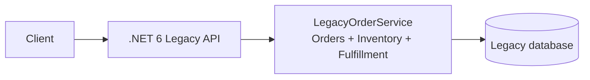
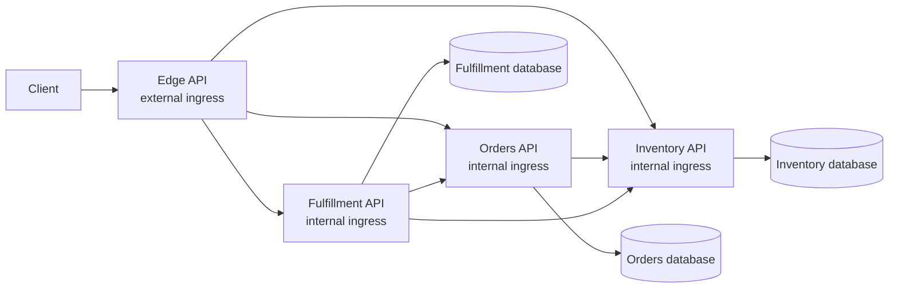

# Month 1 - Agentic Modernization: Retail Order Management

A standalone 60-minute technical session about using GitHub Copilot to assess,
plan, execute, and prove the decomposition of an out-of-support .NET 6 retail
monolith into independently deployable .NET 10 microservices. No prior session
is required.

This is a runnable workshop, not a simulated transcript. The code preserves the
legacy public HTTP contract at an Edge API while Orders, Inventory, and
Fulfillment communicate through explicit HTTP APIs and own separate data stores.

## What is included

| Path | Purpose |
|---|---|
| `src/Legacy.Ordering.Api` | Functional .NET 6 baseline with intentionally coupled order, inventory, and fulfillment logic. |
| `src/Edge.Api` | External .NET 10 facade that preserves the legacy `/api` routes and maps downstream failures to HTTP 503. |
| `src/Orders.Api` | Internal .NET 10 service and Orders-owned database. It checks Inventory through a typed HTTP client. |
| `src/Inventory.Api` | Internal .NET 10 service and Inventory-owned database, including idempotent reservations. |
| `src/Fulfillment.Api` | Internal .NET 10 orchestration service and Fulfillment-owned process state. |
| `tests/Legacy.Characterization.Tests` | Captures observed legacy behavior before change. |
| `tests/Api.Contract.Tests` | Runs legacy and Edge requests through a real four-application TestServer topology and asserts JSON/status parity. |
| `tests/Edge.Integration.Tests` | Verifies Edge behavior, including a backend-unavailable HTTP 503 path. |
| `tests/Orders.Tests`, `tests/Inventory.Tests`, `tests/Fulfillment.Tests` | Focused service-boundary and domain tests. |
| `docker-compose.yml` | Portable before/after topology with separate persisted SQLite stores; optional SQL Server profile for the legacy workload. |
| `infra/` | Optional reference IaC modeling four Azure Container Apps, four identities, three Azure SQL databases, ACR, private networking, and telemetry. |
| `.github/` | Workshop-scoped instructions, custom agent, and reusable Assess/Plan/Execute/Validate prompt files. |

## Prerequisites

- **.NET 10 SDK**. It builds the .NET 10 services and the .NET 6 target.
- **zsh**, **curl**, and **jq** for deterministic local workflows.
- **Docker Engine** for the recommended local path. If the Compose v2 plugin is
  absent, the scripts use the official `docker:cli` image.
- Optional **.NET 6 ASP.NET Core Runtime** only for running the legacy app
  directly. .NET 6 is intentionally retained as the unsupported baseline.
- **GitHub Copilot** with custom agents/prompt files for the live guided flow.
- Optional **Azure CLI with Bicep** only for static reference-IaC compilation.

## Learning objectives

Attendees will be able to:

1. Ground a GitHub Copilot modernization plan in repository evidence rather
   than asking for an unbounded rewrite.
2. Decompose Orders, Inventory, and Fulfillment into independently buildable
   services without exposing backend APIs publicly or sharing database ownership.
3. Preserve callers through an Edge facade and prove status/JSON parity with
   characterization and contract tests.
4. Explain explicit HTTP failure semantics, correlation propagation, bounded
   retries/timeouts, and idempotent inventory reservation.
5. Apply managed identities, Entra-only Azure SQL, health probes, JSON logging,
   and OpenTelemetry/Application Insights in Azure Container Apps.

## Architecture

The legacy application is one process and one database:



The target has one external API and three internal services:



Detailed Mermaid sources:

- [`architecture/legacy.mmd`](./architecture/legacy.mmd)
- [`architecture/modern.mmd`](./architecture/modern.mmd)
- [`architecture/comparison.mmd`](./architecture/comparison.mmd)

The Fulfillment service stores progress as `Started`, `InventoryReserved`, and
`Completed`. Inventory uses the order ID as the reservation ID. A retry after a
partial failure therefore resumes without deducting stock twice. No broker is
needed for this small synchronous demo, and failures remain visible to callers.
Read operations and idempotent fulfillment operations use bounded retries.
Order creation deliberately uses a non-retrying client because a timeout after a
successful commit would otherwise create a duplicate order.

## Quickstart: build and test

Run from this folder:

```zsh
dotnet build GitHubCopilotAzure.Modernization.sln --configuration Release
dotnet test GitHubCopilotAzure.Modernization.sln \
  --configuration Release --no-restore
dotnet list GitHubCopilotAzure.Modernization.sln package \
  --vulnerable --include-transitive
```

The build emits the expected .NET 6 end-of-support warning. All test projects
are environment-independent and require neither Docker nor Azure.

## Recommended local path

```zsh
./scripts/reset.zsh
```

The script:

1. resolves its own path, so it works from any current directory;
2. builds and starts Legacy, Edge, Orders, Inventory, and Fulfillment;
3. keeps backend services on the Compose network rather than host ports;
4. gives each data-owning service a distinct persisted volume;
5. proves seeded read parity and order-to-fulfillment behavior;
6. recreates the data volumes and leaves a clean seeded environment.

Endpoints:

- Legacy baseline: `http://localhost:5001`
- New public Edge API: `http://localhost:5002`

Run the proof again without resetting:

```zsh
./scripts/smoke-test.zsh
```

Reset or clean up:

```zsh
./scripts/reset.zsh
./scripts/cleanup.zsh
```

### Optional SQL Server legacy path

The default uses SQLite because it is portable across x64 and ARM64. To show
the legacy App Service-style SQL dependency:

```zsh
cp .env.example .env
# Set a local-only SQL_PASSWORD in .env.
./scripts/reset.zsh --sql
```

The SQL-backed legacy API is then at `http://localhost:5011`. SQL Server 2022 is
amd64-only. Apple-silicon emulation can be slow or fail in some container
runtimes; use the default SQLite path if that occurs. The three new services
still retain separate service-owned stores.

## Manual local path

For debugging without Compose, run Inventory, Orders, Fulfillment, and Edge on
different ports and override `Services__*` URLs. For example:

```zsh
ASPNETCORE_URLS=http://localhost:5101 \
  dotnet run --no-launch-profile --project src/Inventory.Api

ASPNETCORE_URLS=http://localhost:5102 \
Services__Inventory=http://localhost:5101 \
  dotnet run --no-launch-profile --project src/Orders.Api

ASPNETCORE_URLS=http://localhost:5103 \
Services__Orders=http://localhost:5102 \
Services__Inventory=http://localhost:5101 \
  dotnet run --no-launch-profile --project src/Fulfillment.Api

ASPNETCORE_URLS=http://localhost:5002 \
Services__Orders=http://localhost:5102 \
Services__Inventory=http://localhost:5101 \
Services__Fulfillment=http://localhost:5103 \
  dotnet run --no-launch-profile --project src/Edge.Api
```

Each service defaults to its own SQLite file. Do not point two services at the
same file.

## Guided GitHub Copilot path

Open this Month 1 folder as the workspace so its `.github` assets are active.
Select the `modernization-guide` custom agent and run, in order:

1. `assess-modernization.prompt.md`
2. `plan-modernization.prompt.md`
3. `execute-modernization-slice.prompt.md` for one approved slice
4. `validate-modernization.prompt.md`

The prompts require file/command evidence, public API invariants, service data
ownership, explicit failure behavior, and validation after each slice. They do
not contain fabricated agent responses; wording must be generated live.

## Optional Azure reference architecture

The Bicep files model:

- external ingress only for Edge;
- internal ingress for Orders, Inventory, and Fulfillment;
- one user-assigned identity per app and scoped `AcrPull`;
- three independent Azure SQL databases and identity-specific contained users;
- private SQL connectivity by default;
- Log Analytics and workspace-based Application Insights;
- health probes on port 8080 and cost-sensitive scale/SKU parameters.

They are reference IaC, not a checked-in Azure deployment workflow. The workshop
does not provide scripts to provision, initialize, smoke-test, or delete Azure
resources. Review the design in [`infra/README.md`](./infra/README.md) and, if
Bicep tooling is installed, perform static compilation only:

```zsh
az bicep build --file infra/main.bicep
az bicep lint --file infra/main.bicep
```

The templates require an organization-owned delivery and database migration
process before production use. No credentials are in the templates or outputs.

## Troubleshooting

| Symptom | Resolution |
|---|---|
| `NETSDK1138` for the legacy project | Expected evidence: .NET 6 is out of support. |
| No host .NET 6 runtime | Use Compose; the legacy runtime is inside its container. |
| Docker Compose plugin missing | The zsh wrapper automatically uses `docker:cli`. |
| Docker build fails with NuGet TLS EOF under Colima | Confirm host `dotnet restore` works; retry with Docker Desktop/Rancher Desktop or another Docker network. This is a container-runtime networking failure, not a compile result. |
| SQL Server unhealthy on Apple silicon | Use the default SQLite flow; SQL Server 2022 is amd64-only. |
| Edge returns 503 | Inspect backend health and correlation ID; run `dotnet test tests/Edge.Integration.Tests`. |
| Smoke parity fails | Reset volumes, then run `dotnet test tests/Api.Contract.Tests`. |
| Bicep tooling missing | Run `az bicep install`, then `az bicep build --file infra/main.bicep`. |

## Pedagogical limitations

- The service split is intentionally small. Production decomposition also
  requires traffic analysis, data migration, ownership agreements, SLOs, and
  operational maturity.
- The flow is synchronous by design. A broker would add more operational and
  teaching surface than this 60-minute scenario needs.
- The legacy credential-shaped setting is a non-secret placeholder. It teaches
  configuration assessment without introducing an exploitable vulnerability.
- SQLite is the portable local store, not the Azure production recommendation.
- Basic SKUs, one warm replica per app, and one region favor demo reliability
  and bounded cost over production availability. Set `minReplicas=0` only when
  cold-start 503s are acceptable.
- Guided mode is used for inspectability; it is not a claim that every
  production migration should use identical stage boundaries.

## Cleanup

Local cleanup is safe and scoped to the Compose project:

```zsh
./scripts/cleanup.zsh
```

No Azure resources are created by the workshop, so it provides no Azure cleanup
automation.

## Official references

- [Upgrading projects with GitHub Copilot](https://docs.github.com/en/copilot/tutorials/upgrade-projects)
- [GitHub Copilot upgrade overview for .NET](https://learn.microsoft.com/en-us/dotnet/core/porting/github-copilot-upgrade/overview)
- [Best practices for GitHub Copilot](https://docs.github.com/en/copilot/get-started/best-practices)
- [GitHub Copilot custom instructions](https://docs.github.com/en/copilot/concepts/prompting/response-customization)
- [GitHub Copilot custom agents](https://docs.github.com/en/copilot/concepts/agents/copilot-cli/about-custom-agents)
- [GitHub Copilot prompt files](https://docs.github.com/en/copilot/tutorials/customization-library/prompt-files)
- [.NET migration guidance](https://learn.microsoft.com/en-us/dotnet/core/porting/)
- [.NET 10 container images use Ubuntu 24.04](https://learn.microsoft.com/en-us/dotnet/core/compatibility/containers/10.0/default-images-use-ubuntu)
- [ASP.NET Core 10 Docker images](https://learn.microsoft.com/en-us/aspnet/core/host-and-deploy/docker/building-net-docker-images?view=aspnetcore-10.0)
- [.NET on Azure Container Apps](https://learn.microsoft.com/en-us/azure/container-apps/dotnet-overview)
- [Managed identity for Azure SQL](https://learn.microsoft.com/en-us/azure/azure-sql/database/authentication-azure-ad-user-assigned-managed-identity)
- [OpenTelemetry with Application Insights](https://learn.microsoft.com/en-us/azure/azure-monitor/app/opentelemetry-enable)

Use [`session-guide.md`](./session-guide.md), [`talk-track.md`](./talk-track.md),
and [`demo-runbook.md`](./demo-runbook.md) to present the session.
